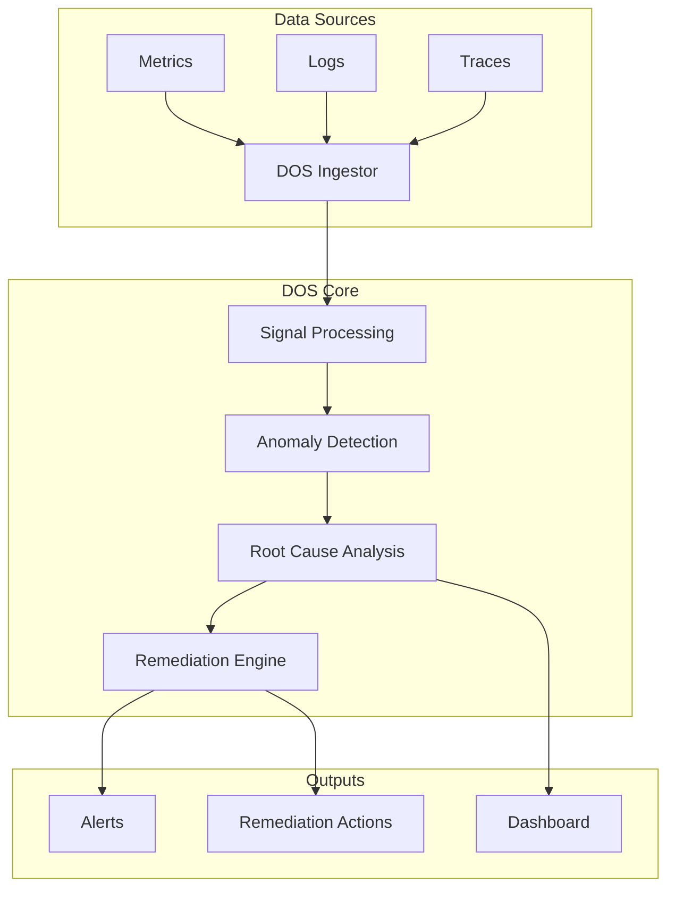
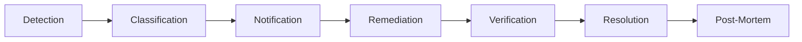
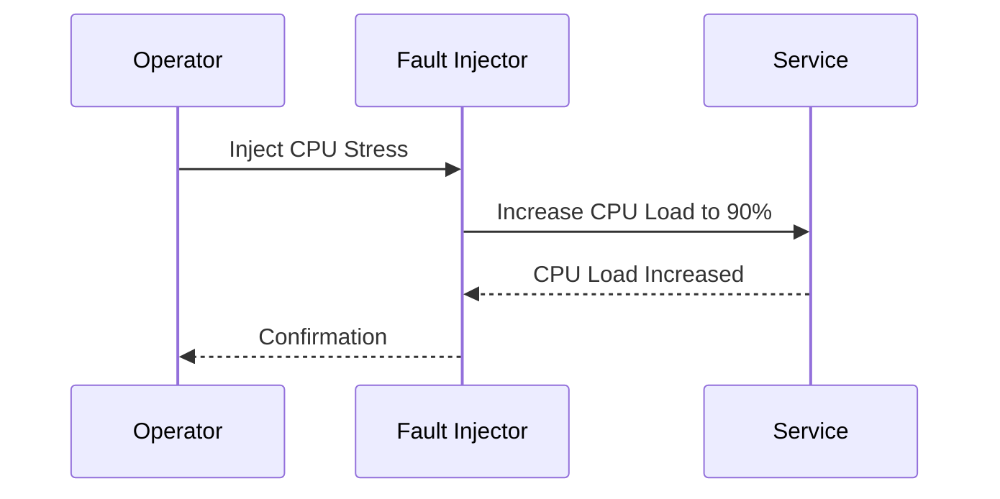
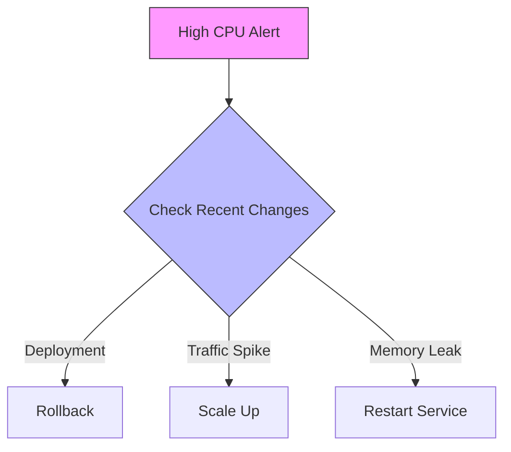
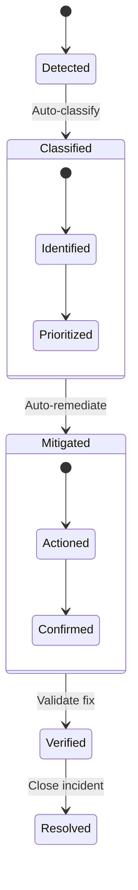
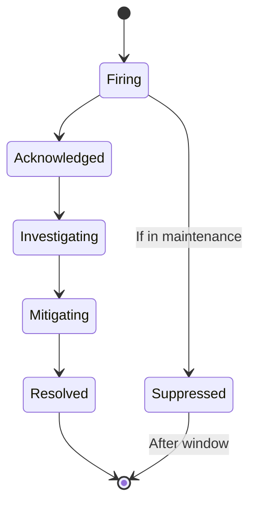
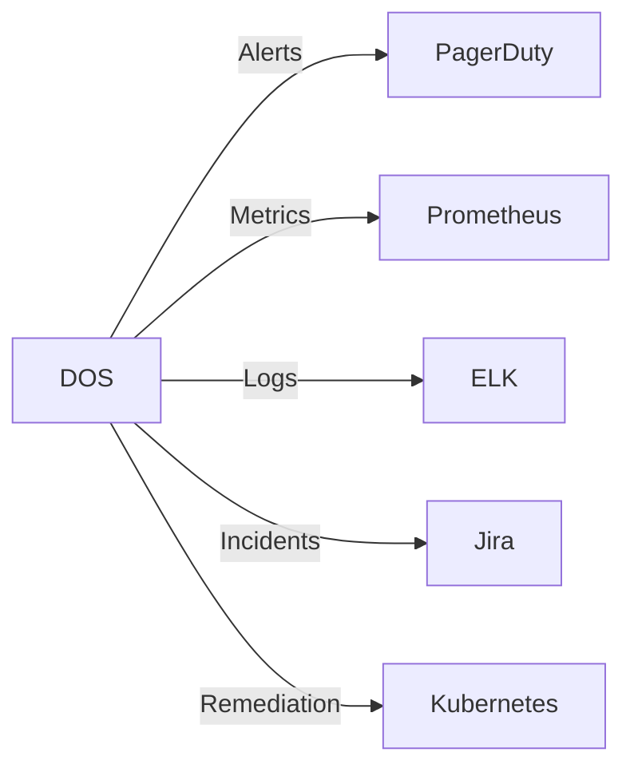

# DOS Incident Management Flow

## System Architecture



## Alert Lifecycle



## Fault Injection Walkthrough

### 1. Fault Injection


### 2. Detection
```mermaid
timeline
    title Anomaly Detection Timeline
    section Metrics Collection
        Metric 1: 50% CPU :a1, 2023-01-01, 1m
        Metric 2: 75% CPU :a2, after a1, 1m
        Metric 3: 92% CPU :a3, after a2, 1m
    
    section Alert Generation
        Threshold: 85% CPU
        Alert Fired :alert, after a3, 1m
```

### 3. Root Cause Analysis


### 4. Remediation Flow


## Example: CPU Stress Test Walkthrough

### 1. Pre-Conditions
- Monitoring enabled on target service
- Baseline metrics established
- Alert thresholds configured (e.g., CPU > 85% for 5 minutes)

### 2. Fault Injection
1. **Action**: Inject CPU load using stress-ng
   ```bash
   stress-ng --cpu 4 --timeout 300s
   ```
2. **Expected**: CPU utilization spikes to ~100%

### 3. Detection Phase (0-2 minutes)
- **System**: Detects CPU threshold breach
- **Actions**:
  - Records metrics
  - Triggers alert
  - Creates incident ticket

### 4. Analysis Phase (2-5 minutes)
- **System**:
  - Correlates metrics
  - Identifies affected services
  - Runs root cause analysis
- **Output**:
  - Service: frontend
  - Root Cause: High CPU
  - Impact: High

### 5. Remediation (5-7 minutes)
- **Automatic Actions**:
  - Scale up service pods
  - Route traffic away from affected instance
- **Manual Steps**:
  - Review recent deployments
  - Check for memory leaks

### 6. Verification (7-10 minutes)
- **Checks**:
  - CPU returns to baseline
  - No errors in logs
  - Service health checks pass

### 7. Resolution
- **Actions**:
  - Document incident
  - Update runbooks
  - Adjust thresholds if needed

## Alert States



## Key Metrics

| Metric | Threshold | Action |
|--------|-----------|--------|
| CPU Usage | >85% for 5m | Scale up pods |
| Memory | >90% for 10m | Restart service |
| Error Rate | >1% for 2m | Trigger rollback |
| Latency p99 | >500ms | Scale or optimize |

## Integration Points



## Best Practices

1. **Alerting**:
   - Set meaningful thresholds
   - Avoid alert fatigue
   - Use multi-dimensional alerting

2. **Remediation**:
   - Start with least privilege
   - Implement circuit breakers
   - Document all actions

3. **Documentation**:
   - Keep runbooks updated
   - Document false positives
   - Review incidents weekly
